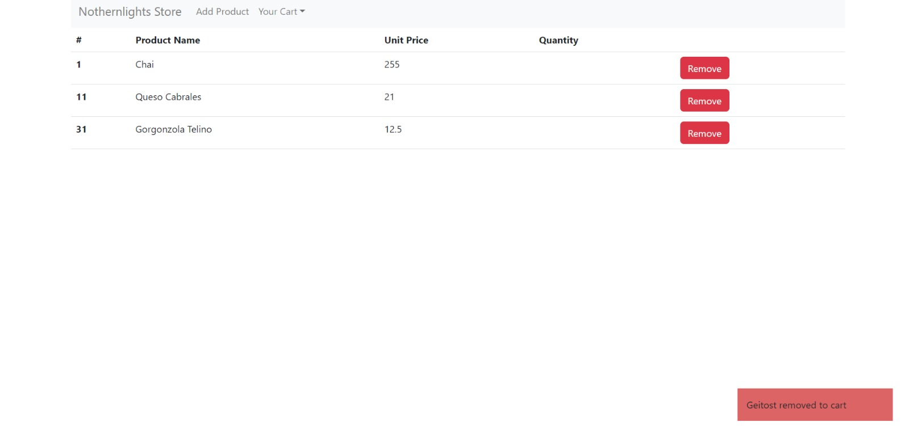
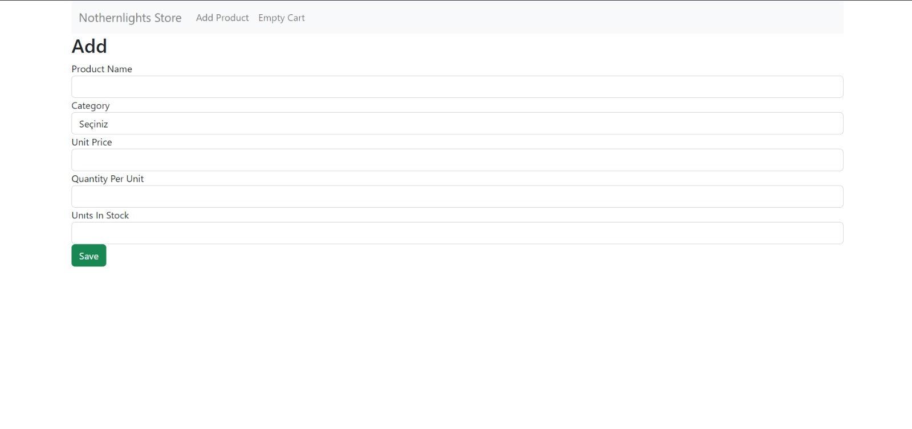
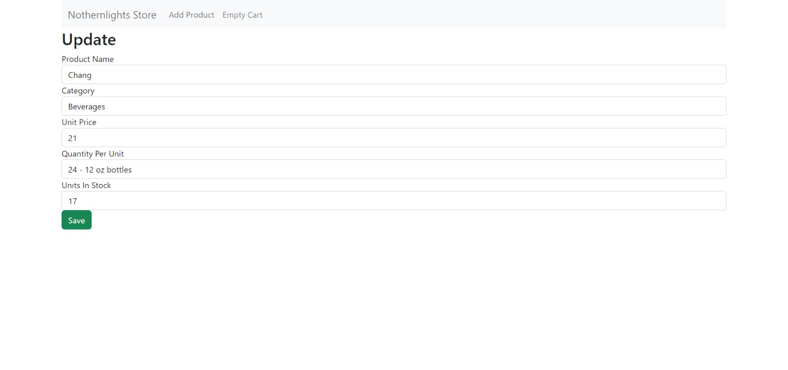
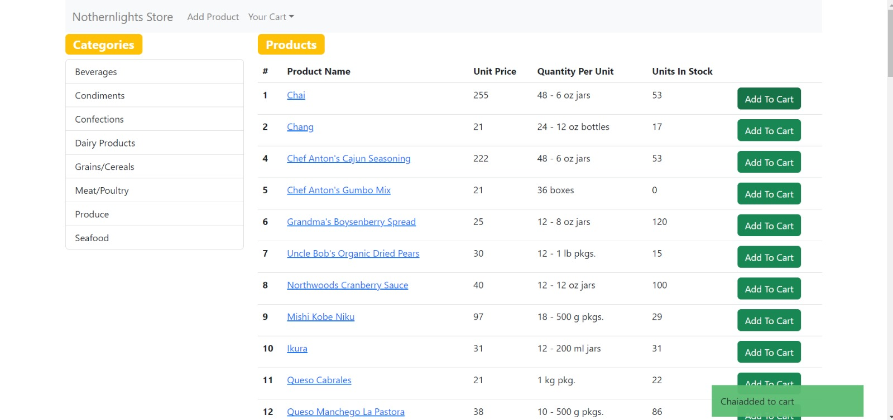
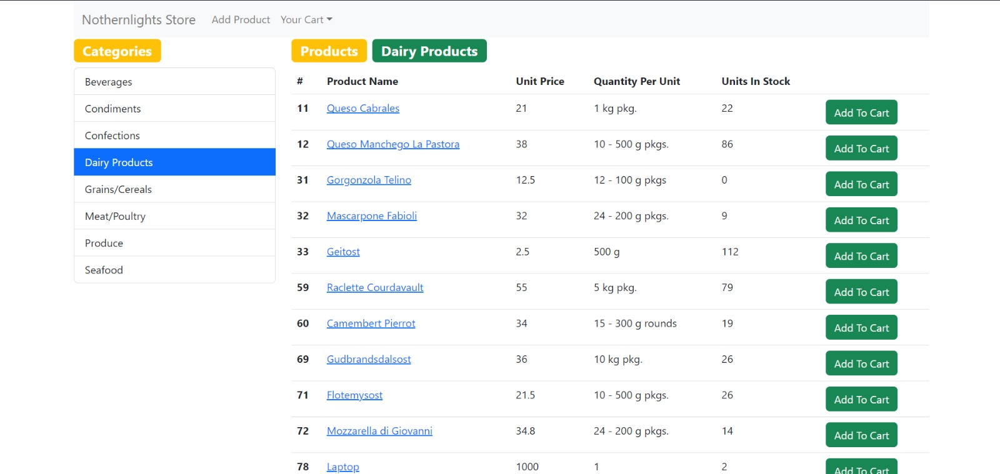

<h2>NORTHERNLIGHTS</h2>

In this project, I used product add, product remove and product filter functions. I defined
functions and states using redux. Products are fetched from json file. The api was created by
running the json file on 3000.port with json-server. Responsive design was used in the project

Key Points;

<ul>
  <li>Add to cart</li>
  <li>Remove from cart</li>
  <li>Update cart</li>
  <li>Product filtering</li>
</ul>
<h2>USAGE</h2>

1. Fork the repo and then clone it or download it.

2.First install all dependencies:

  <storng>npm install</storng> (with npm)  
  <storng>yarn</storng> (or with yarn)

  

3. Install json-server

  npm install -g json-server

4. Start the api

4.1. Enter api file

  

json-server --watch db.json

  

5. Start the server

  

  npm start [OR] yarn start

6. Now run the app

localhost:[PORT]

<h3>Cart</h3>
  
<h3>Add To Cart</h3>
  
<h3>Update Cart</h3>

 
  

